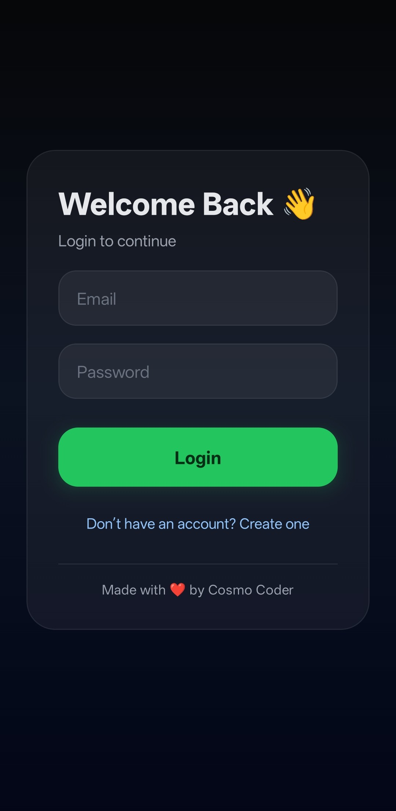
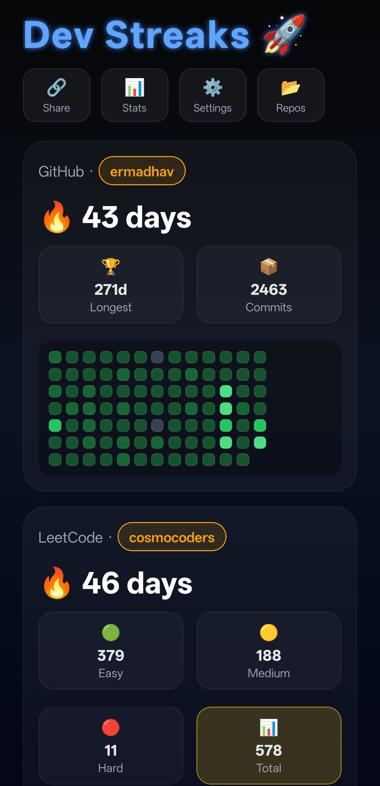
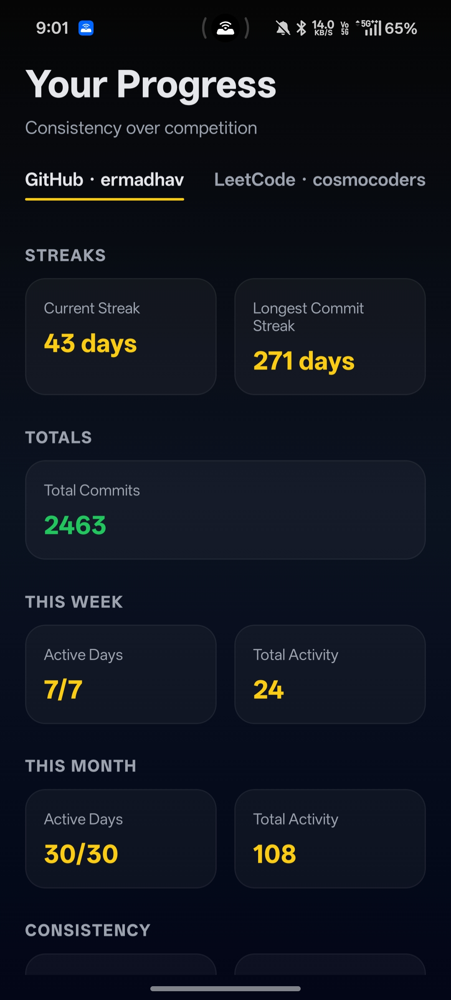
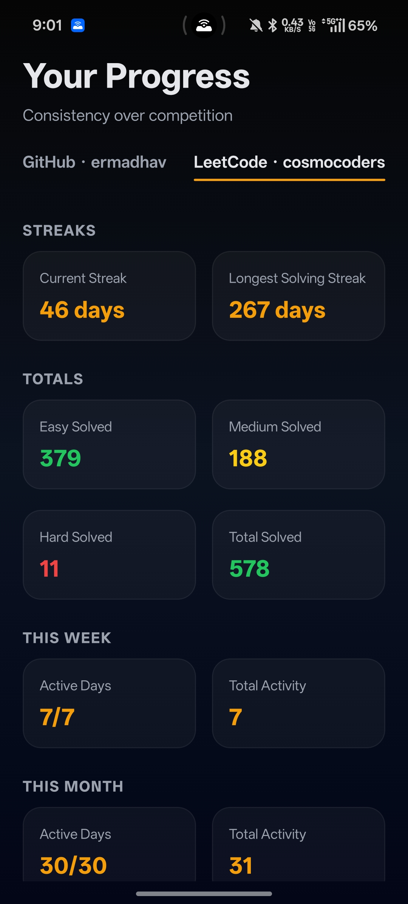
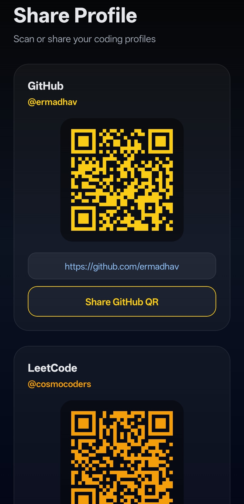
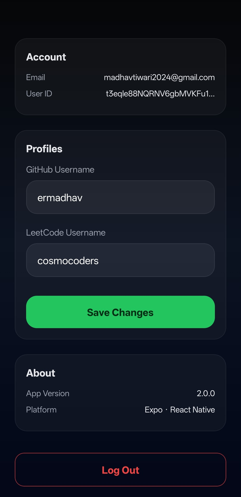
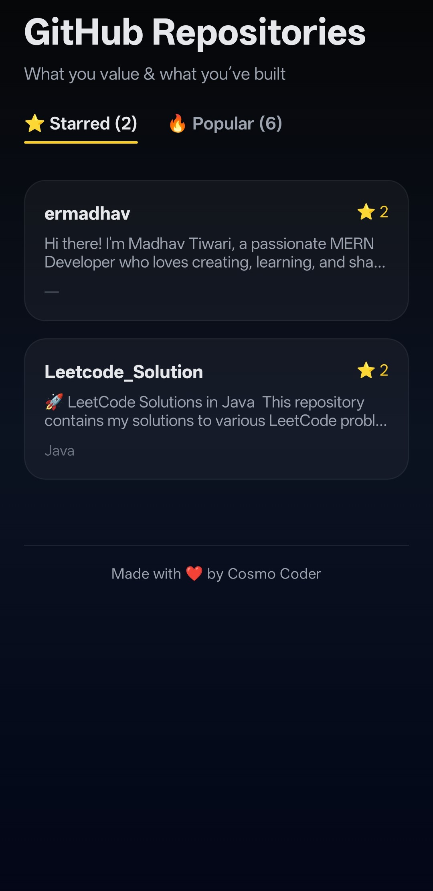
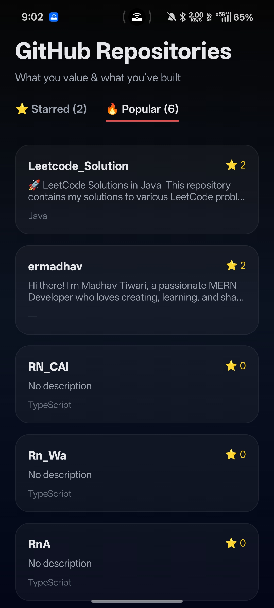

# 🔥 Dev Streaks Tracker

Track your **GitHub commits** and **LeetCode problem-solving streaks** in one beautiful mobile app.  
Built with **Expo + React Native**, designed for **developers who care about consistency**.

> _“Consistency beats intensity.”_

---

## ✨ Features

### 🧩 GitHub
- ✅ Current commit streak
- 🏆 Longest commit streak
- 📦 Total commits
- 📊 Contribution heatmap (last 90 days)
- ⭐ Starred & popular repositories
- 🔔 Smart streak reminder notifications

### 🧠 LeetCode
- ✅ Current solving streak
- 🏆 Longest solving streak
- 🟢 Easy / 🟡 Medium / 🔴 Hard solved count
- 🟰 Total problems solved
- 📊 Submission heatmap (last 90 days)
- ⏰ IST-based reminders (5:30 AM reset)

### 📈 Stats Dashboard
- Weekly & monthly activity summaries
- Active days tracking
- GitHub vs LeetCode comparison
- Consistency insights

### 🔗 Profile Sharing
- Auto-generated QR codes for:
  - GitHub profile
  - LeetCode profile
- One-tap profile sharing
- Direct profile links

### ⚙️ Settings & Account
- Update GitHub & LeetCode usernames
- View account information
- App version details
- Secure logout

---

## 📱 Screenshots & Feature Walkthrough

Each screen below highlights a core feature of the Dev Streaks Tracker app.

---

### 📝 1. Create Account
Create your account by entering email, password, GitHub username, and LeetCode username.

<p align="center">
  
</p>

✔ Simple onboarding  
✔ Developer identity setup  
✔ Clean UI  

---

### 🔐 2. Login
Secure login to access your dashboard and stats.

<p align="center">
  
</p>

✔ Fast authentication  
✔ Minimal UI  
✔ Smooth navigation  

---

### 🏠 3. Home Dashboard
Live GitHub and LeetCode streaks with heatmap visualization and summary metrics.

<p align="center">
  
</p>

✔ Current streak  
✔ Longest streak  
✔ Total commits / problems solved  
✔ Contribution heatmap  
✔ Quick navigation buttons  

---

### 📊 4. Detailed Stats
Track weekly and monthly performance with consistency insights.

<p align="center">
  
  
</p>

✔ Active days tracking  
✔ Weekly & monthly activity  
✔ GitHub vs LeetCode analytics  
✔ Performance trends  

---

### 🔗 5. Profile Sharing (QR Codes)
Instantly share your coding profiles using QR codes.

<p align="center">
  
</p>

✔ Auto-generated QR codes  
✔ One-tap sharing  
✔ Direct profile links  

---

### ⚙️ 6. Settings & Account
Manage profile details and app configuration.

<p align="center">
  
</p>

✔ Update usernames  
✔ Account info  
✔ App version  
✔ Logout  

---

### ⭐ 7. GitHub Repositories
Browse starred and popular repositories inside the app.

<p align="center">
  
  
</p>

✔ Starred repositories  
✔ Popular repositories  
✔ Language tags  
✔ Star count visibility  

---

## 🛠 Tech Stack

- **React Native**
- **Expo (Dev Client)**
- **TypeScript**
- **expo-router**
- **expo-notifications**
- **GitHub GraphQL API**
- **LeetCode GraphQL API**
- **react-native-svg**
- **Linear Gradients & Custom UI**

---

## 🧠 Architecture

```txt
app/
 ├── index.tsx            # Home screen
 ├── stats.tsx            # Stats dashboard
 ├── profile-share.tsx    # QR & sharing screen
 ├── repos.tsx            # Starred / popular repos
 ├── settings.tsx

hooks/
 ├── useGithubStreak.ts
 ├── useLeetCodeStreak.ts
 ├── useUsernames.ts

components/
 ├── Heatmap.tsx
 ├── StreakCard.tsx
 ├── StatCard.tsx

utils/
 ├── notifications.ts
 ├── scheduleNotifications.ts
 ├── stats.ts
 ├── healthScore.ts
